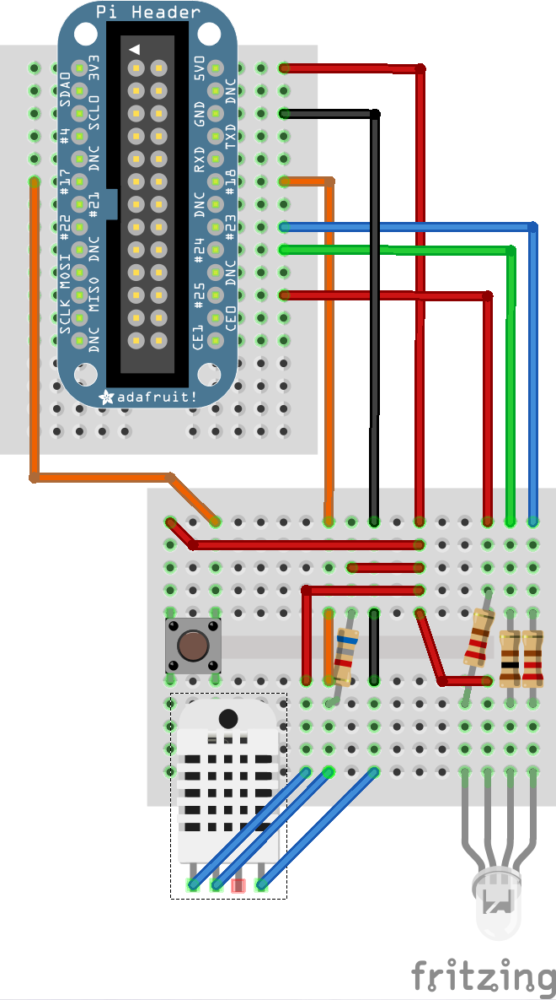

# LED Temperature Indicator

A RaspberryPi-based imitation of the [Gro Egg](http://gro.co.uk/gro-egg). Integrates with [data.sparkfun.com](https://data.sparkfun.com/), private [Phant Servers](http://phant.io/), and [Google Sheets](https://docs.google.com/spreadsheets/).

## Features

* An RGB LED indicates when room is too cold (blue light), just right (green light), or too hot (red light)
* Push-button toggles through levels of brightness
* Optionally uploads read data to third party datalogging service (Phant, Google Sheets)

## Installation

1. Install `nodejs` (developed against `v4.2.1`) and `npm` (developed against `3.7.3`)
1. Install `pigpio` as described [here](https://www.npmjs.com/package/pi-gpio#installation)
1. Install node requirements: `npm install`

## Running

1. `sudo node rgb_temp.js`

If you'd like to set this up as a service, see `scripts/upstart.conf` for an example Upstart script and instructions.

## Wiring

I split out tooling onto two nini breadboards as that was all I had.

<h2>Assembly List</h2>
<table>

  <thead>
   <tr>
    <th>Label</th>
    <th>Part Type</th>
    <th>Properties</th>
    </tr>
  </thead>
  <tbody>
  <tr>
    <td>LED1</td>
    <td>RGB LED (com. cathode, rgb)</td>
    <td class="props">package 5 mm [THT]; rgb RGB; polarity common cathode; pin order rgb</td>
</tr><tr>
    <td>Pi1</td>
    <td>Adafruit Pi Cobbler</td>
    <td class="props">manufacturer Adafruit Industries</td>
</tr><tr>
    <td>R1</td>
    <td>220Ω Resistor</td>
    <td class="props">package THT; resistance 220Ω; bands 4; pin spacing 400 mil; tolerance ±5%</td>
</tr><tr>
    <td>R2</td>
    <td>100Ω Resistor</td>
    <td class="props">package THT; resistance 100Ω; bands 4; pin spacing 400 mil; tolerance ±5%</td>
</tr><tr>
    <td>R4</td>
    <td>220Ω Resistor</td>
    <td class="props">package THT; resistance 220Ω; bands 4; pin spacing 400 mil; tolerance ±5%</td>
</tr><tr>
    <td>R5</td>
    <td>6.8kΩ Resistor</td>
    <td class="props">package THT; resistance 6.8kΩ; bands 4; pin spacing 400 mil; tolerance ±5%</td>
</tr><tr>
    <td>RHT1</td>
    <td>Humidity and Temperature Sensor RHT03</td>
    <td class="props">sensing element Polymer humidity capacitor; power supply 3.3-5.5V DC; output signal Digital Signal</td>
</tr><tr>
    <td>S1</td>
    <td>Pushbutton</td>
    <td class="props">package [THT]</td>
</tr>
  </tbody>
</table>
<h2>Shopping List</h2>
<table>
  <thead>
	<tr>
    <th>Amount</th>
    <th>Part Type</th>
    <th>Properties</th>
    </tr>
  </thead>
  <tbody>
<tr>
    <td>1</td>
    <td>RGB LED (com. cathode, rgb)</td>
    <td class="props">package 5 mm [THT]; rgb RGB; polarity common cathode; pin order rgb</td>
</tr><tr>
    <td>1</td>
    <td>Adafruit Pi Cobbler</td>
    <td class="props">manufacturer Adafruit Industries</td>
</tr><tr>
    <td>2</td>
    <td>220Ω Resistor</td>
    <td class="props">package THT; resistance 220Ω; bands 4; pin spacing 400 mil; tolerance ±5%</td>
</tr><tr>
    <td>1</td>
    <td>100Ω Resistor</td>
    <td class="props">package THT; resistance 100Ω; bands 4; pin spacing 400 mil; tolerance ±5%</td>
</tr><tr>
    <td>1</td>
    <td>6.8kΩ Resistor</td>
    <td class="props">package THT; resistance 6.8kΩ; bands 4; pin spacing 400 mil; tolerance ±5%</td>
</tr><tr>
    <td>1</td>
    <td>Humidity and Temperature Sensor RHT03</td>
    <td class="props">sensing element Polymer humidity capacitor; power supply 3.3-5.5V DC; output signal Digital Signal</td>
</tr><tr>
    <td>1</td>
    <td>Pushbutton</td>
    <td class="props">package [THT]</td>
</tr>
  </tbody>
</table>
